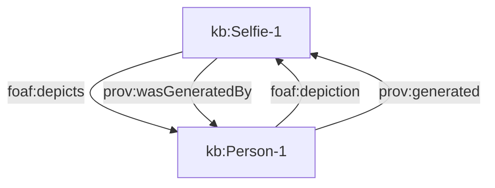

# JSON-LD framing

This directory demonstrates [JSON-LD Framing](https://www.w3.org/TR/json-ld11-framing/).

## CASE/UCO File demonstration

A demonstration is provided to re-shape all `uco-observable:File`s found in a graph.

* `frame.py` - A minimal wrapper around a Framing implementation[^1].
* `case_file_frame.jsonld` - A JSON-LD Frame describing selection criteria and output form.  This frame selects nodes typed as `uco-observable:File` and inlines `uco-types:Hash`es and the linking `uco-observable:ContentDataFacet`s.
* `two_files_flattened.jsonld` - An input graph, containing:
   - Nodes that should be included in the framed results (four `uco-observable:File`s and their linked nodes).
   - Nodes that should be included in the framed results, even lacking links to hashes (two `uco-observable:File`s).
   - Nodes that should be included *with full repetition* in the framed results (a shared `uco-types:Hash`).
   - Nodes that should be included in the framed results after subclass entailment (a `uco-observable:ArchiveFile` that is not also explicitly typed as a `uco-observable:File`, though the typing is implicit from the ontology).
   - Nodes that will not be included in the framed results (a `uco-core:Bundle`, and a `uco-types:Hash` not associated with one of the included `File`s).
   - Nodes that attempt to induce an infinite reference loop by linking to each other (two `uco-observable:File`s form one loop).  The attempt does not succeed.
* `two_files_framed.jsonld` - The output graph.

## Longer loop demonstration

This demonstration re-uses `frame.py` and `case_file_frame.jsonld` from above.

* `selfie_flattened.jsonld` - An input graph, denoting a "selfie" picture file.  Records are kept under a certain usage of FOAF and PROV-O.  The loop demonstrates multiple paths to return to the same file.

[^1]: Participation by NIST in the creation of the documentation of mentioned software is not intended to imply a recommendation or endorsement by the National Institute of Standards and Technology, nor is it intended to imply that any specific software is necessarily the best available for the purpose.
